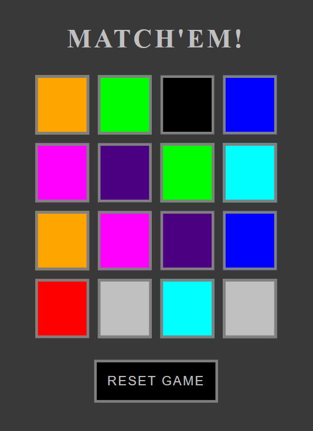
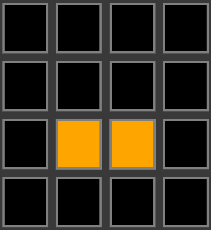
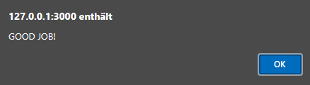

# MATCH'EM!

- This simple memory game, was inspired by the card game we propably all played when we were kids.  
  In hopes to relieve some of the stress of daily life and to jump back into childhood memories.

  - 

## Features:

- ## 16 (4x4) "CARDS"

  - The 16 playing cards light up in 8 different colors.
  - At most there are two of the same color.
  - You can only light up two cards at the same time.
  - If the cards show different colors, they go back to the original black coloration.
  - If the cards show the same color, they'll stay lit up. 

  - 

- ## Finding all Matches

  - After finding all 8 pairs, the user get's the notifitication: 'GOOD JOB!'

  - 

- ## Reset Button

  - The reset button allows the user to reset the page at any given moment.
  - It is an improtant feature for the immersion of the user even if it's only a simple game like memory.

  - 

## Testing:
- ## Validator Testing

  - ### HTML
    - No errors were found when passing through the official [W3C validator](https://validator.w3.org/nu/?doc=https%3A%2F%2Fmagitnup.github.io%2Fmatch-em%2F)
  - ### CSS
    - No errors were found when passing through the official [Jigsaw](http://jigsaw.w3.org/css-validator/validator?lang=en&profile=css3svg&uri=https%3A%2F%2Fmagitnup.github.io%2Fmatch-em%2F&usermedium=all&vextwarning=&warning=1)
  
  - ### JavaScript
    - No errors were found when passing through the official [Jshint validator](https://jshint.com/)
      - The following metrics were returned: 
      - There are 3 functions in this file.
      - Function with the largest signature take 1 arguments, while the median is 0.
      - Largest function has 19 statements in it, while the median is 6.
      - The most complex function has a cyclomatic complexity value of 7 while the median is 1.

  - ### Unfixed Bugs
    - No unfixed bugs.

- ## Deployment
  - The site was deployed to GitHub pages. The steps to deploy are as follows:
    - In the GitHub repository, navigate to the Settings tab 
    - From the source section drop-down menu, select the Master Branch
    - Once the master branch has been selected, the page will be automatically refreshed with a detailed ribbon display to indicate the successful deployment. 

  The live link can be found here - https://magitnup.github.io/match-em/

## Credits
  - Special Thanks to my sister and mother who were working tiredlessly on my siters VwA (End of Degree Project for highschool)
  - ### Media
    - favicon.ico: [PixaBay](https://pixabay.com/illustrations/question-brain-ideas-brainstorming-2004314/)

## Finally
  - I had a lot of fun playing around with JavaScript and am looking forward to Python!
  - I think I found something very fun :D